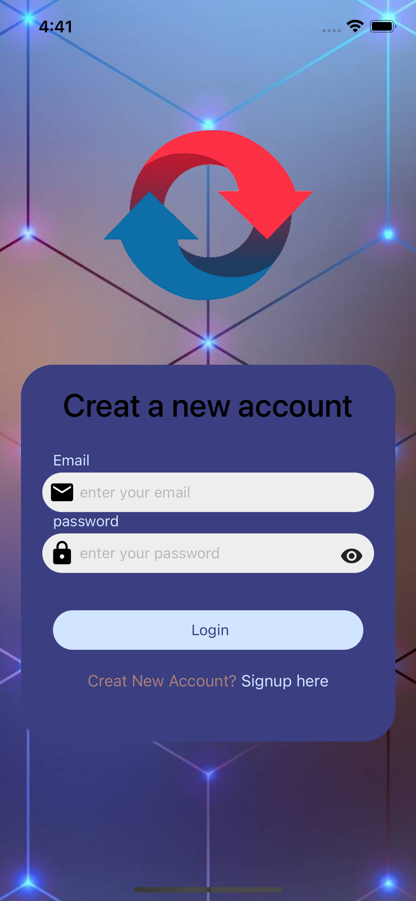
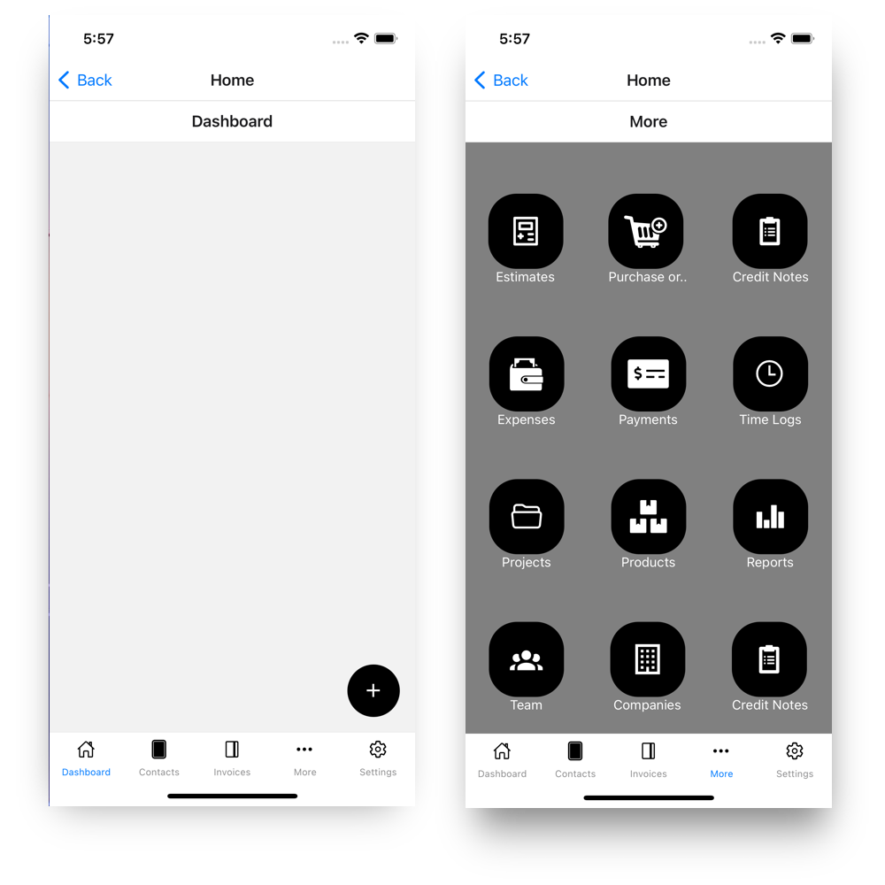

## Screenshots

### Mobile Apps (iOS & Android)

# How to build/run the projects

## General requirements before running any specific project

- `npm install` to install all the dependencies node_modules
- `bundle install` to install all the dependencies of bundle
- `cd ios` change directory to ios directory
- `pod install` to install all the dependencies of pods
- `npm start` to start the project
