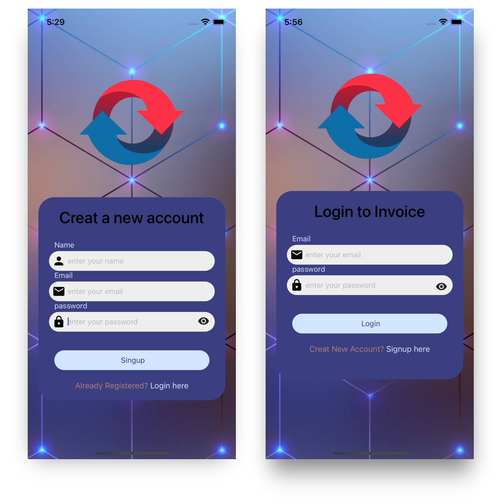

## Screenshots

### Mobile Apps (iOS & Android)

# How to build/run the projects

## General requirements before running any specific project

- `npm install` to install all the dependencies, React and React Native among others.
- `bundle install` to install all the dependencies, React and React Native among others.
- cd ios.
- `pod install` to install all the dependencies, React and React Native among others.
- `npm start` to start the project
